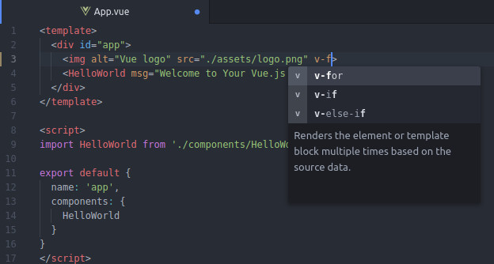

# atom-ide-vue package

Vue language support for [Atom IDE](https://atom.io/packages/atom-ide-base)

## Getting Started

1. Install `atom-ide-vue` from Atom's packages repository

2. Install [language-vue](https://atom.io/packages/language-vue)

3. Install [Atom IDE](https://atom.io/packages/atom-ide-base) packages

Note: Since Atom comes with [autocomplete+](https://atom.io/packages/autocomplete-plus) package preinstalled, basic suggestions should be available immediately.

## Contributing

Take a look at [Contributing Guide](CONTRIBUTING.md).

[atom ide]: https://atom-ide-community.github.io/
